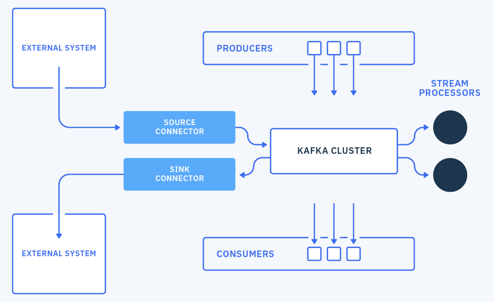

# Part 1 - Setup and Prerequisites

## Kafka overview

[Apache Kafka](https://kafka.apache.org) is a distributed streaming platform. It provides publish-subscribe APIs and can store and process streams of records at large scale.

Kafka is made up of the following components:
- Broker: One of more brokers form a Kafka cluster
- Producer: Client to send records into Kafka
- Consumer: Client to read records from Kafka
- Admin: Client to manage Kafka clusters
- Connect: Runtime for Sink and Source Connectors to stream data between external systems and Kafka
- Streams: Library to process streams of records in real time



You can learn more about Kafka in this introductory article, "[What is Apache Kafka](https://developer.ibm.com/articles/an-introduction-to-apache-kafka/)" or in this conference presentation, "[Introducing Apache Kafka](https://developer.ibm.com/videos/an-introduction-to-apache-kafka/)."

## Prerequisites for this workshop

In order to complete this workshop, you need to have the following dependencies installed:

- [Java SDK](https://openjdk.java.net/install/), Version 8 or above
- [gradle](https://gradle.org/install/), Version 6 or above

## Downloading Apache Kafka

In this workshop, we will use the Kafka command line tools.

[Download](http://kafka.apache.org/downloads) the 2.5.1 source package from the [Apache Kafka website](http://kafka.apache.org/), uncompress it, and compile it.

```sh
> tar -xzf kafka-2.5.1-src.tgz
> cd kafka-2.5.1-src
> gradle
> ./gradlew assemble   # This command takes a few minutes to complete
```

This workshop assumes you are running a Unix-based platform like macOS or Linux and will use the scripts from the `bin` directory in the examples. If you are on Windows, use the scripts that are in the `bin/windows` directory.

## Kafka cluster

This workshop requires access to a Kafka cluster. If you don't already have a Kafka cluster, you can use [IBM Event Streams](https://www.ibm.com/cloud/event-streams) or setup a Kafka cluster on your computer.

- If you want to use IBM Event Streams, follow the [Event Streams setup](./event-streams.md) steps.

- If you want to use a local Kafka cluster, follow the [local Kafka setup](./local-kafka.md) steps.


## Next Steps

Continue to [Part 2](../part2/README.md).
